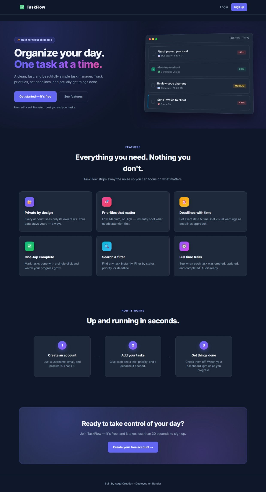
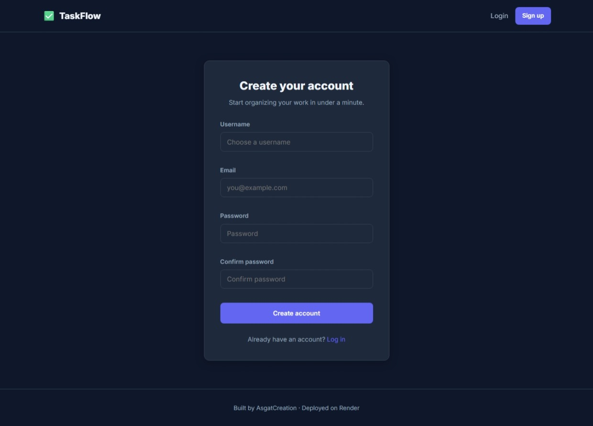
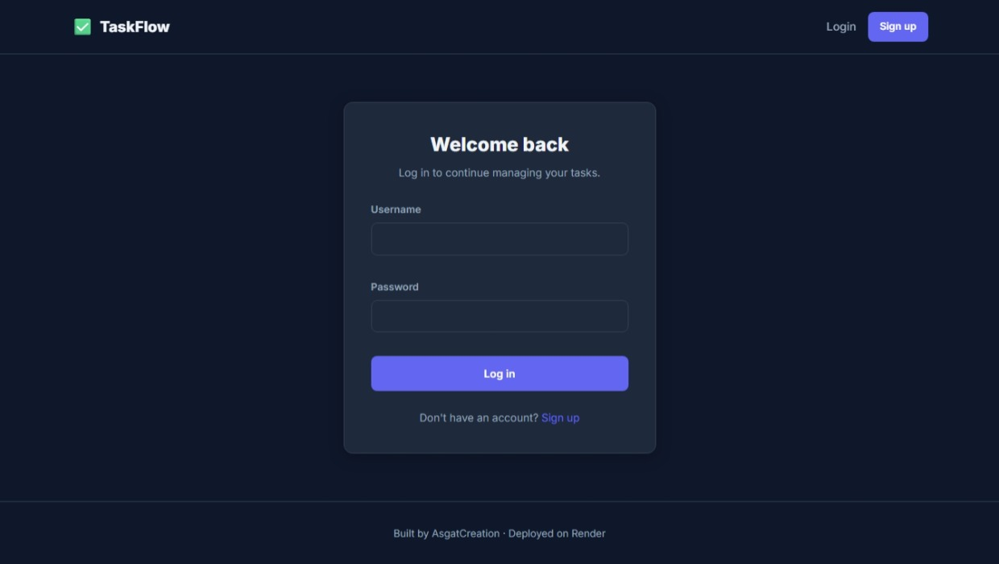
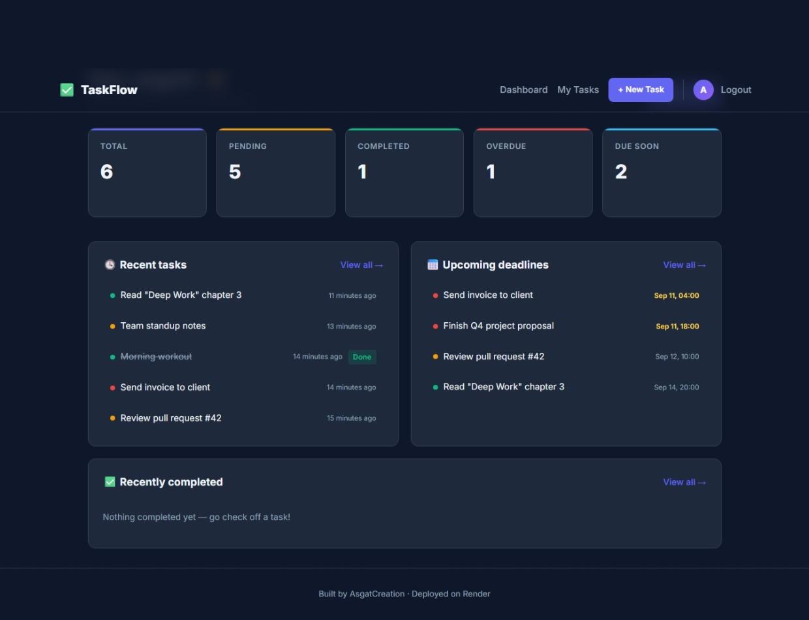
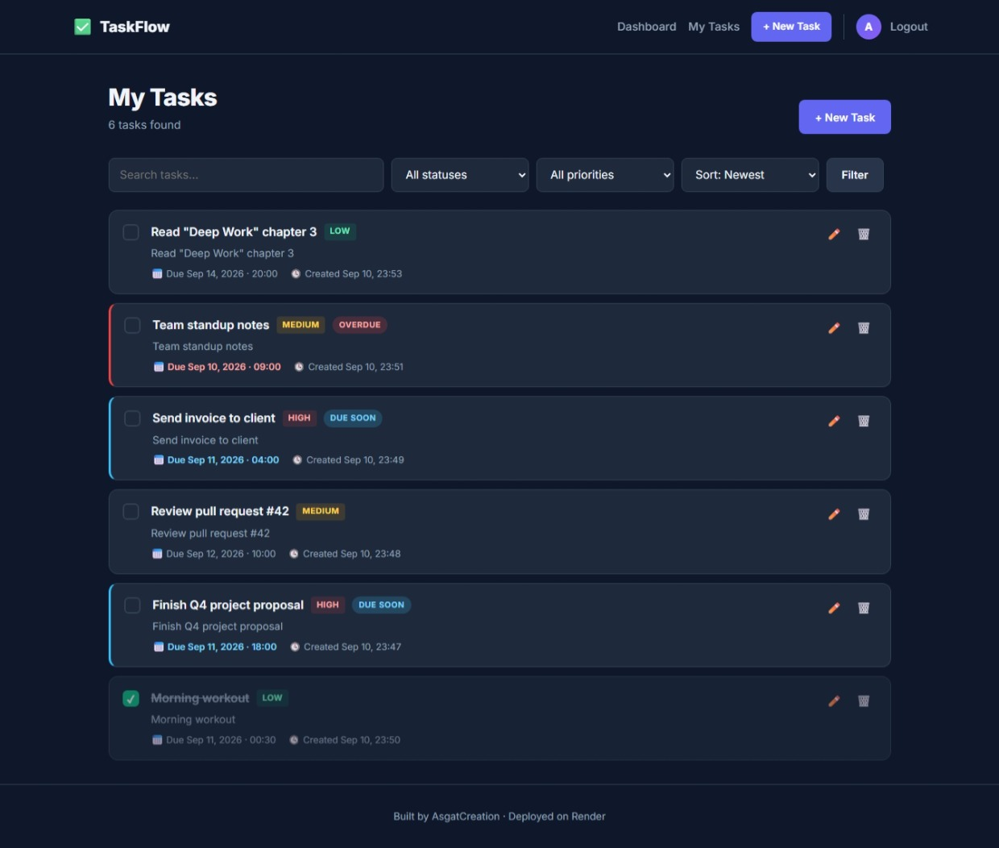
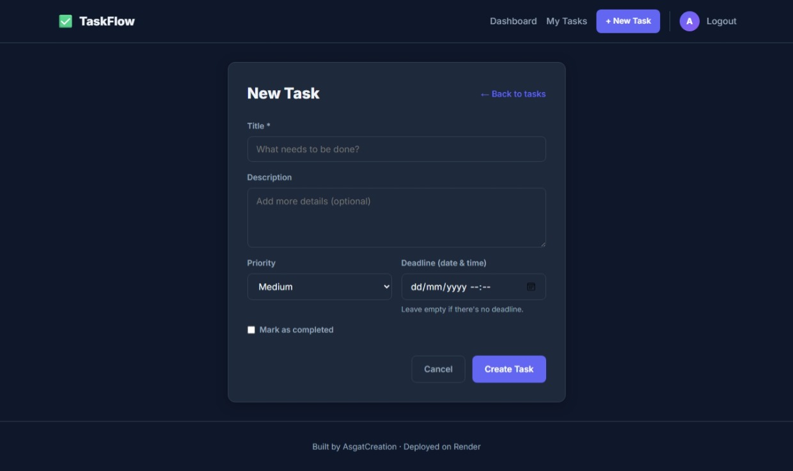
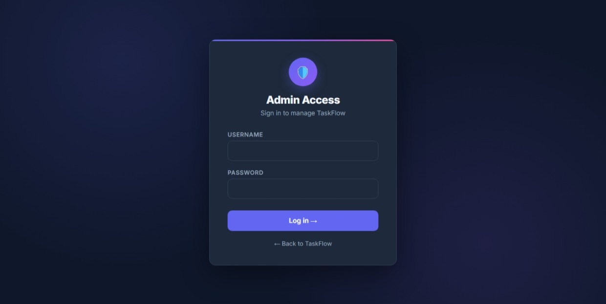

<div align="center">

# ✅ TaskFlow

**A production-ready task manager built with Django 5**

Manage your day, one task at a time — with per-user accounts, priorities, deadlines, and a clean dark UI.

[](https://www.djangoproject.com/)
[](https://www.python.org/)
[](https://www.postgresql.org/)
[](https://render.com/)

[**🚀 Live Demo**](https://django-todo-app-8dio.onrender.com) · [**🐛 Report Bug**](../../issues) · [**✨ Request Feature**](../../issues)

> ⚠️ Hosted on Render's free tier — the first load may take ~30 seconds while the app wakes up.

</div>

---

## 📖 Table of Contents

- [About the Project](#-about-the-project)
- [Screenshots](#-screenshots)
- [Features](#-features)
- [Tech Stack](#-tech-stack)
- [Getting Started](#-getting-started)
- [Project Structure](#-project-structure)
- [Deployment](#-deployment)
- [Roadmap](#-roadmap)
- [Author](#-author)

---

## 🎯 About the Project

TaskFlow is a fully-featured task manager that demonstrates a **complete, production-ready Django workflow** — from local development to a live deployment on Render with PostgreSQL.

It's built to solve real problems: user isolation, per-account data, deadline tracking, priority management, and a UI that doesn't fight you.

---

## 📸 Screenshots

### 🌄 Landing Page


### 🔐 Authentication
<table>
<tr>
<td width="50%">

**Sign up**  


</td>
<td width="50%">

**Log in**  


</td>
</tr>
</table>

### 📊 Dashboard


### 📋 Task List


### ✏️ Task Form


### 🛡️ Admin Dashboard


---

## ✨ Features

| | Feature |
|---|---|
| 🔐 | **Authentication** — Register, login, logout with custom forms |
| 👤 | **Per-user isolation** — You only ever see your own tasks |
| ✏️ | **Full CRUD** — Create, read, update, delete tasks |
| ⚡ | **Priorities** — Low / Medium / High with visual badges |
| ⏰ | **Deadlines with time** — Set exact due date and time |
| 🚨 | **Overdue detection** — Auto-highlights tasks past deadline |
| 🔍 | **Search & filter** — By keyword, status, priority, overdue |
| 📊 | **Live dashboard** — Clickable stat cards, recent + upcoming panels |
| 🕓 | **Time trail** — See when a task was created, updated, completed |
| 🌙 | **Modern dark UI** — Responsive, mobile-friendly, no build step |
| 🚀 | **Production-ready** — PostgreSQL, Whitenoise, Gunicorn, HSTS |

---

## 🧰 Tech Stack

| Layer | Technology |
|---|---|
| **Framework** | Django 5.0 |
| **Language** | Python 3.12 |
| **Database (prod)** | PostgreSQL (Render) |
| **Database (dev)** | SQLite |
| **Server** | Gunicorn |
| **Static Files** | Whitenoise |
| **Config** | python-dotenv, dj-database-url |
| **Hosting** | Render (Blueprint via `render.yaml`) |
| **Version Control** | Git + GitHub |

---

## 🚀 Getting Started

### Prerequisites

- Python 3.12+
- pip
- Git

### Installation

```bash
# 1. Clone the repo
git clone https://github.com/asgatcreation/taskflow-app.git
cd taskflow-app

# 2. Create and activate a virtual environment
python -m venv venv
venv\Scripts\activate          # Windows
# source venv/bin/activate     # macOS / Linux

# 3. Install dependencies
pip install -r requirements.txt

# 4. Configure environment
copy .env.example .env         # Windows
# cp .env.example .env         # macOS / Linux

# 5. Apply migrations
python manage.py migrate

# 6. (Optional) Create an admin user
python manage.py createsuperuser

# 7. Run the dev server
python manage.py runserver